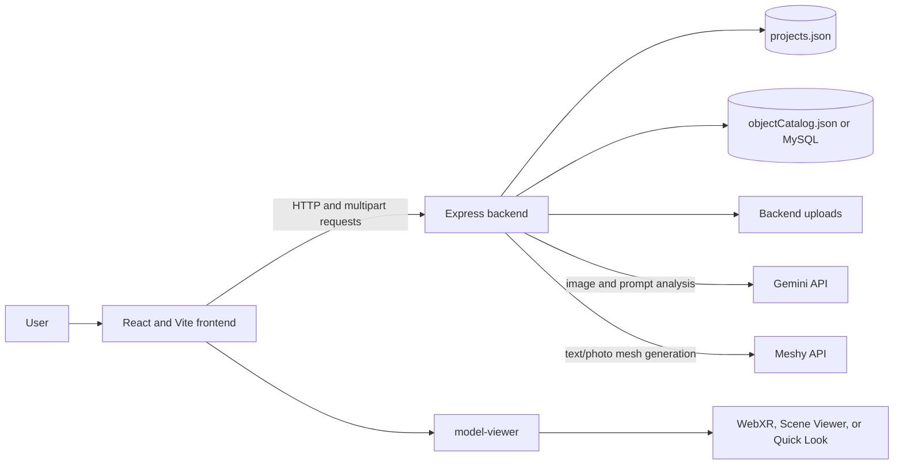

# BlueVision Project Description

## 1. Project Overview

Bluevision is a full-stack browser application for turning ideas and images into inspectable 3D content. It brings text prompts, floor-plan conversion, object-photo processing, a manual blueprint tool, AI plan analysis, a 3D viewer, AR sharing, and project history into one workspace.

The application is designed around two different image workflows:

- **Floor plans** are processed locally into an approximate, color-separated GLB building shell.
- **Object photos** can be previewed without a provider or sent to Meshy for image-to-3D generation.

Gemini has two distinct roles: it can improve free-form text prompts before Meshy generation, and it can visually analyze a selected floor-plan image to produce room/layout observations and suggestions. Gemini is not the mesh-generation service; Meshy generates provider-based GLB/USDZ assets.

## 2. Project Goals

- Make 3D asset creation accessible through a visual browser interface.
- Provide several creation paths: catalog, text, object image, and architectural floor plan.
- Give floor-plan output understandable materials and editable colors.
- Use Gemini for visible, useful image understanding, not just hidden backend processing.
- Allow users to inspect, save, reopen, and share 3D content.
- Make provider-free paths useful for demonstrations and local development.

## 3. Technology

| Layer | Technology | Responsibility |
| --- | --- | --- |
| Frontend | React, TypeScript, Vite | Dashboard, upload controls, project gallery, viewer, Gemini result display |
| Styling and interaction | Tailwind CSS, Motion, Lucide | Layout, animation, and interface icons |
| Backend | Node.js, Express, Multer | API routes, uploads, project persistence, provider requests |
| Image processing | Sharp | Decode, rotate, resize, and threshold floor-plan images |
| 3D format | glTF 2.0 binary GLB | Locally generated building shell and provider-produced models |
| 3D viewer | Google `<model-viewer>` | Model inspection, material editing, AR entry points |
| AI analysis and prompt support | Google Gemini API | Floor-plan vision analysis and optional prompt refinement |
| Provider-based mesh generation | Meshy API | Free-form text-to-3D and object-photo-to-3D |
| Persistence | JSON files by default; optional MySQL catalog | Project records and object catalog |

## 4. System Architecture

The React application calls the Express backend for model generation, image uploads, project history, saved-plan conversion, QR creation, Gemini analysis, and configuration status. Provider secrets remain on the backend and are not embedded in frontend source code.



### Main application state

The frontend keeps the active viewer asset, search query, catalog, and project refresh counter in `Frontend/src/app/App.tsx`. Feature components receive callbacks to update the viewer and reload project history after successful operations.

### Project persistence

Every project record has an ID, title, type, source, model URL, date, and creation timestamp. Some types also have an iOS USDZ URL or a conversion marker. The backend stores these records in `Backend/data/projects.json`. Uploaded images and generated local GLBs live in `Backend/uploads/`.

## 5. Features

### 5.1 Object Catalog and Text to 3D

The catalog contains labeled models, URLs, aliases, and descriptions. A prompt matching a catalog item loads that existing GLB without calling an AI provider.

For prompts that do not match the catalog:

1. The frontend submits the text to `POST /generate`.
2. When Gemini is configured, the backend may rewrite the prompt as a more descriptive visual prompt.
3. The resulting prompt is submitted to Meshy for text-to-3D generation.
4. The returned GLB/USDZ URLs are stored in the project history and loaded in the viewer.

If Gemini prompt refinement fails, the backend falls back to the user's original prompt. New free-form model generation still requires Meshy.

### 5.2 Floor Plan to 3D

The Floor plan upload mode runs locally and does not require Gemini or Meshy to produce a model.

The converter:

1. Reads a JPG/PNG image using Sharp, applies orientation, resizes it, and converts it to grayscale.
2. Estimates the background and thresholds the image into wall/ink pixels.
3. Finds sufficiently long horizontal and vertical line runs and groups neighboring runs.
4. Estimates the plan bounds and maps image coordinates into approximate model dimensions.
5. Adds a floor slab, classifies detected boundary lines as exterior walls, and classifies other lines as interior walls.
6. Writes a binary glTF (GLB) containing independent geometry primitives and materials.
7. Saves the source and model paths as a Blueprint to 3D project and opens the GLB in the viewer.

The default materials are warm stone for the floor, soft ivory for exterior walls, and muted teal for interior walls. The viewer offers independent color pickers, coordinated palettes, reset, roughness, and metalness controls.

The converter is a geometric approximation. It does not reconstruct precise wall topology, dimensions, room labels, doors, windows, roof geometry, furniture, structural properties, or code compliance. It is best suited to clear, high-contrast, top-down plans with visible long horizontal and vertical strokes.

### 5.3 Gemini Floor Plan Analysis

The Gemini Floor Plan Analysis panel can analyze either a selected local image or a saved image-backed plan. Saved images appear in a dropdown, so the user does not need to upload the same plan again.

The frontend sends the image as multipart form data to `POST /ai/analyze-floorplan`. The backend:

1. Validates that Gemini is configured and that the upload is JPG or PNG.
2. Sends the image bytes and a constrained JSON-output instruction to the configured Gemini model.
3. Parses and limits the response fields.
4. Returns a summary, visible-space candidates with evidence/location, layout observations, and recommendations.
5. The frontend renders the analysis with a reminder that it is advisory.

The prompt directs Gemini not to invent measured dimensions, safety judgments, code compliance, or certainty that the drawing does not support. Gemini's output is still an AI interpretation and should be checked against the original drawing.

#### Connecting Gemini

- Create a key in Google AI Studio.
- In the UI, paste it into the Gemini setup field and press **Connect Gemini**.
- For local development, a key entered in the panel is held in backend process memory. It is cleared on backend restart and is not saved in browser storage.
- A persistent local key can instead be configured as `GEMINI_API_KEY` in `Backend/.env`.
- The default model is `gemini-3.8-flash`; `GEMINI_MODEL` can override it.

The key-setup endpoint is restricted to a loopback browser/backend connection. Never add a key to frontend code, screenshots, public repositories, or documentation.

### 5.4 Object Photo Upload

The Object photo mode accepts JPG and PNG files.

- Without Meshy, the backend stores the source image and creates an image-preview project.
- With Meshy, the backend sends the image to image-to-3D and stores the generated model URLs when the provider returns them.
- GLB models open in the 3D viewer. USDZ is used for iPhone Quick Look where available.

A photo of an object should use Object photo mode; a floor plan should use Floor plan mode.

### 5.5 Manual Blueprint Builder

The Manual Blueprint Builder generates a 2D SVG floor plan from dimensions and counts. The user sets:

- Length: 4-40 m
- Width: 4-30 m
- Floors: 1-5
- Rooms: 1-12
- Entrances: 1-4

The preview updates as values change. Selecting Generate validates and saves the blueprint, displays it in the viewer, and adds it to project history. This tool currently creates a 2D plan; it does not automatically extrude its SVG into a 3D building.

### 5.6 3D Viewer and Material Editing

The viewer uses `<model-viewer>` in an embedded document. It supports drag/touch rotation, zoom, camera presets, auto-rotation, reset view, fullscreen, roughness, metalness, and AR launch modes.

For converted floor-plan GLBs, the color panel maps each picker to its named GLB material:

- Floor
- Exterior walls
- Interior walls

Palette presets change those three materials together; Custom allows independent choices; Reset restores the original palette. Ordinary models retain a general base-color picker.

### 5.7 AR and QR Sharing

When a model is active, the frontend requests an AR link from `POST /ar/link`. The backend returns a standalone `/ar/view` URL and QR image data URL. A phone scans the QR and opens the model page.

- Android may use WebXR or Scene Viewer.
- iPhone uses Quick Look when a USDZ file is available.
- Phone and model URLs must be reachable from each other.
- Production WebXR requires HTTPS.

### 5.8 Today's Projects

The backend retains the full project history. The website gallery filters the response and displays records whose saved project date matches today's local date, currently shown in `en-US` format. The refresh button reloads data but does not remove the date filter. Older records are hidden from this view, not deleted.

## 6. User Workflows

### Workflow A: Analyze a saved floor plan with Gemini

1. Start the frontend and backend.
2. Connect Gemini from the Blueprint to 3D panel if it is not already configured.
3. Select a saved floor plan from **Plan to analyze**, or choose a new local JPG/PNG.
4. Press **Analyze with Gemini**.
5. Review the returned summary, visible-space candidates, layout observations, and suggestions.
6. Verify interpretations against the original image before using them in design decisions.

### Workflow B: Convert a floor plan to a 3D shell

1. Select **Floor plan**.
2. Choose a clear top-down JPG/PNG.
3. Press **Generate 3D Building**.
4. The local converter detects wall strokes and creates the color-separated GLB.
5. Rotate, recolor, and inspect the result in the 3D Viewer. Use AR sharing on a compatible device.

### Workflow C: Generate an object from text

1. Enter a prompt in the text-to-3D prompt field.
2. Catalog matches load immediately.
3. For a new object, configure Meshy; Gemini can optionally refine the prompt.
4. The generated model is added to the project history and shown in the viewer.

### Workflow D: Convert an object photo

1. Switch to **Object photo**.
2. Select a JPG/PNG object image.
3. Without Meshy, upload it for preview. With Meshy configured, select the generate action for a 3D result.
4. Inspect the image or resulting model in the viewer.

### Workflow E: Create a manual 2D blueprint

1. Open Manual Blueprint Builder.
2. Set dimensions, floor count, rooms, and entrances within the supported ranges.
3. Review the live SVG preview.
4. Generate and reopen the saved plan from Today's Projects on the same date.

### Workflow F: Share a model in AR

1. Load a 3D model in the viewer.
2. Go to AR Experience and generate the QR/link if it is not already visible.
3. Open the link on a supported phone or scan the QR.
4. Use HTTPS for deployed WebXR and provide a USDZ file for iPhone Quick Look.

## 7. API Overview

| Method | Route | Purpose |
| --- | --- | --- |
| `GET` | `/health` | Health check |
| `GET` | `/config` | Provider readiness status |
| `POST` | `/config/gemini` | Set a Gemini key for this local backend process |
| `GET` | `/stats` | Project and upload statistics |
| `GET` | `/projects` | Return complete project history |
| `GET` | `/catalog/objects` | Read catalog entries |
| `POST` | `/catalog/objects` | Add/update a catalog entry |
| `GET` | `/generate/supported-prompts` | Return available prompt/catalog examples |
| `POST` | `/generate` | Catalog lookup or text-to-3D generation |
| `POST` | `/ai/analyze-floorplan` | Gemini analysis of a multipart JPG/PNG image |
| `POST` | `/upload` | Floor-plan GLB conversion or object-photo workflow |
| `POST` | `/projects/:projectId/convert-floorplan` | Convert/refresh a saved image-backed floor plan |
| `POST` | `/manual-build` | Validate manual-builder values and create an SVG |
| `POST` | `/ar/link` | Generate AR viewer URL and QR data |
| `GET` | `/ar/view` | Serve standalone model-viewer page |
| `GET` | `/uploads/:filename` | Serve source images and local GLBs |

## 8. Data Files

- `Backend/data/projects.json` stores project metadata.
- `Backend/data/objectCatalog.json` stores the JSON object catalog.
- `Backend/data/textPromptDataset.csv` contains example prompts and object IDs.
- `Backend/uploads/` stores uploaded source images and generated local floor-plan models.
- `Database/mysql-schema.sql` creates the optional MySQL catalog.

The gallery's today filter is frontend display behavior. It does not alter `projects.json` or remove upload files.

## 9. Security and Privacy

- Provider keys belong on the backend, never in frontend source code.
- The in-app Gemini key is sent to the local backend, retained in process memory, and cleared at restart.
- `GET /config` returns booleans only, not key values.
- The backend key-configuration endpoint accepts loopback-origin requests only.
- `Backend/.env` is tracked in this checkout. Untrack it before saving real credentials there, and revoke any credentials that may already have been committed.
- Gemini analysis is not a substitute for professional architectural, structural, accessibility, or code review.

## 10. Limitations

- Local floor-plan-to-GLB is a line-detection/extrusion approximation, not CAD/BIM reconstruction.
- Door/window openings, labels, furniture, exact wall joins, and multi-storey geometry are not reconstructed from arbitrary uploaded plans.
- The manual builder creates a 2D SVG only.
- Free-form provider-based mesh generation depends on valid Meshy credentials, provider availability, quotas, and network access.
- Gemini analysis depends on a valid key, an available model, network access, and a readable image.
- AR behavior depends on the device, browser, secure origin, public model URL, and USDZ availability for iPhone Quick Look.

## 11. Development and Tests

Install dependencies once, then run:

```powershell
npm run dev
npm run build
npm --prefix Backend test
```

The backend tests use synthetic floor-plan images and mocked Gemini responses. They do not spend provider quota or verify a physical AR device.

## 12. Repository Structure

```text
Backend/
  data/                 Project history and object catalog
  src/server.js         Express API and provider orchestration
  src/floorPlanToGlb.js Local floor-plan raster-to-GLB converter
  src/geminiFloorPlan.js Gemini vision request/response handling
  test/                 Backend automated tests
  uploads/              Uploaded images and generated local GLBs
Database/               Optional MySQL schema and database notes
Frontend/
  src/app/App.tsx        Main dashboard composition and app state
  src/app/components/    Feature UI components
  src/styles/            Global styles
README.md                Setup, API, and operations guide
Project Description.md   Full feature, architecture, and workflow explanation
```
